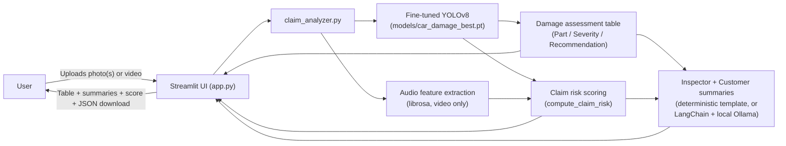
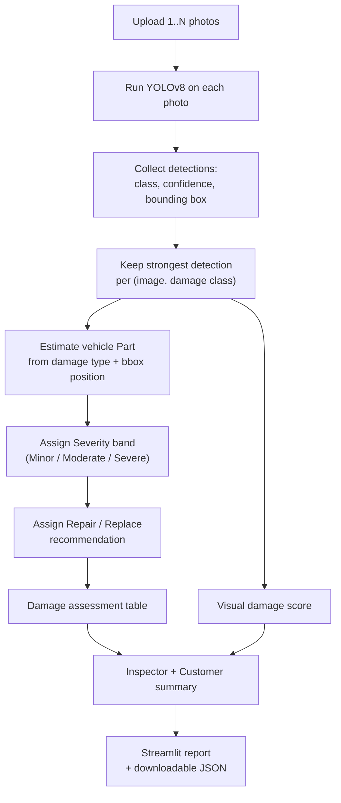
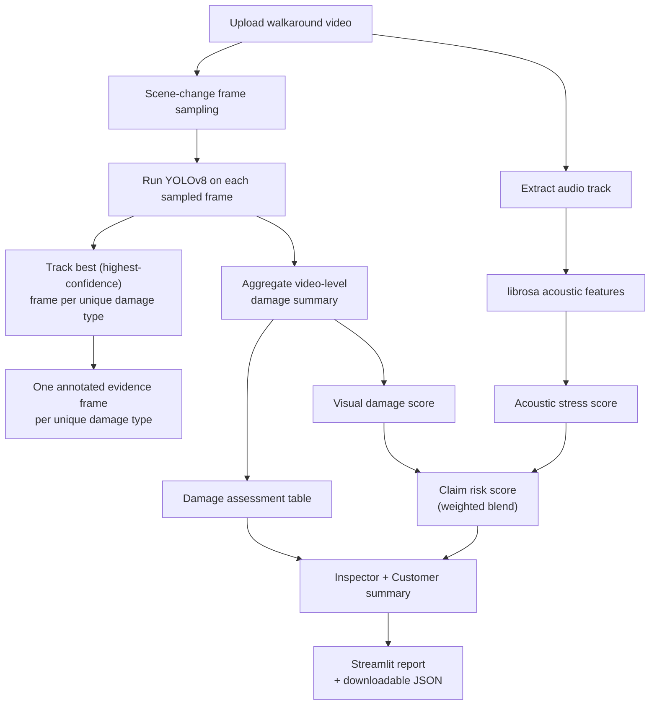
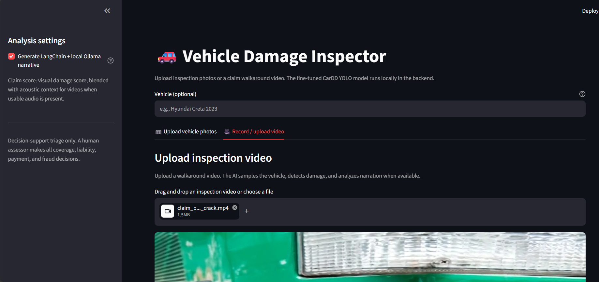

# 🚗 Vehicle Damage Inspector

AI-assisted vehicle damage inspection for insurance and fleet use cases. Upload inspection
photos (one or many) or a walkaround video, and the app runs a fine-tuned YOLOv8 damage
detector, estimates a per-part damage assessment, scores claim risk, and generates both a
professional (inspector) and plain-language (customer) summary — with a downloadable JSON
report for every run.

> **Decision-support tool only.** It produces a *triage priority*, not a coverage, payment,
> liability, or fraud decision. A qualified human assessor makes all material insurance
> decisions; every score and summary this app produces should be confirmed by one.

---

## Table of contents

- [What it does](#what-it-does)
- [Architecture](#architecture)
- [How a photo inspection works](#how-a-photo-inspection-works)
- [How a video inspection works](#how-a-video-inspection-works)
- [Damage assessment table: how "Part" and "Severity" are derived](#damage-assessment-table-how-part-and-severity-are-derived)
- [Claim risk score](#claim-risk-score)
- [Repository structure](#repository-structure)
- [Notebooks (development pipeline)](#notebooks-development-pipeline)
- [Setup and run](#setup-and-run)
- [Try it with the bundled demo videos](#try-it-with-the-bundled-demo-videos)
- [Known limitations](#known-limitations)

---

## What it does

- **Flexible upload** — one photo, many photos, or a single walkaround video. No fixed
  Front/Rear/Left/Right angle requirement.
- **Real-time detection** — a YOLOv8 model fine-tuned on the [CarDD](https://cardd-ustc.github.io/)
  dataset detects `dent`, `scratch`, `crack`, `glass shatter`, `lamp broken`, `tire flat`.
- **Vehicle damage assessment table** — Part / Damage / Severity / Recommendation, similar to
  a real inspection report.
- **Two auto-generated summaries** — an Inspector summary (technical) and a Customer summary
  (plain language), from the same underlying findings.
- **Claim risk score** — a transparent, auditable blend of visual damage and (for video)
  acoustic stress, with a plain-language recommendation.
- **De-duplicated evidence** — for video, one representative frame per unique damage type is
  shown, not every sampled frame.
- **Downloadable report** — every analysis can be exported as structured JSON.

## Architecture



Everything runs locally: the YOLO model, the audio analysis, and the deterministic scoring.
The LangChain + Ollama step is optional and only rewrites the two summaries using the same
computed facts — it never changes the risk score itself (the app validates this and falls
back to the deterministic summary if the score would differ or the local LLM is unavailable).

## How a photo inspection works



Only photos with at least one detection are shown as annotated evidence, so a large batch of
mostly-clean photos doesn't flood the report.

## How a video inspection works



Scene-change sampling can pull several near-identical frames of the same damage. Instead of
showing all of them, the app keeps only the single best frame per unique damage type — so the
evidence gallery stays readable no matter how long the walkaround video is.

## Damage assessment table: how "Part" and "Severity" are derived

The fine-tuned model detects a **damage type** (dent, crack, …), not a **vehicle panel** —
there is no panel-segmentation model in this project. To still produce a readable Part
column, `estimate_vehicle_part()` in `claim_analyzer.py` makes a best-effort guess from the
damage class plus where the bounding box falls in the photo/frame (e.g. a crack in the lower-
center area → "Front / Rear Bumper"; a broken lamp on the left → "Left Headlight/Taillight").

**This is a heuristic, clearly labelled as such in the UI — it is not a verified panel-level
detection, and a human assessor should confirm the exact part before any repair/replace
decision is finalized.**

| Step | Logic |
|---|---|
| **Severity band** | `confidence × class severity weight` → Severe ≥ 0.60, Moderate ≥ 0.35, else Minor. Severity weights: `crack`/`glass shatter` = 1.0, `tire flat` = 0.9, `dent`/`lamp broken` = 0.7, `scratch` = 0.4. |
| **Recommendation** | `Replace` if Severity = Severe, otherwise `Repair`. |
| **De-duplication** | Rows are grouped by `(part, damage class)`, keeping only the highest-confidence detection — repeated detections of the same damage across photos/frames don't produce duplicate rows. |
| **Overall severity** | The highest severity across all rows (`Severe` > `Moderate` > `Minor` > `None`). |

## Claim risk score

```
claim_risk_score = visual_weight × visual_damage_score + audio_weight × acoustic_stress_score
```

- Photos (no audio): `visual_weight = 1.0`, i.e. the score is 100% visual evidence.
- Video with usable audio: `audio_weight = 0.20`, `visual_weight = 0.80` — vehicle damage is
  always the primary signal; acoustic indicators are supporting context, so their
  contribution is deliberately capped.
- Video with no usable audio: falls back to 100% visual, same as photos.

The score also carries a **signal relationship** flag (`agreement` / `mixed` / `conflict`) —
for example, high visual damage with low acoustic stress, or vice versa — surfaced to the
assessor as a review note, never hidden.

| Score | Risk band | Recommendation |
|---|---|---|
| < 35 | Low | Routine human review |
| 35–64 | Moderate | Standard human assessor review |
| ≥ 65 | High | Priority human assessor review |

## Repository structure

```
vehicle-damage-inspector/
├── app.py                     # Streamlit UI — upload, run analysis, render report
├── claim_analyzer.py          # Detection, scoring, assessment table, summary logic
├── run_risk_scoring.py        # Batch-fuses cached visual+audio reports (used for demo data)
├── requirements.txt
├── data.yaml                  # YOLO class map used at training time
├── README.md
│
├── models/
│   └── car_damage_best.pt     # Fine-tuned YOLOv8 damage detector (the only model app.py loads)
│
├── demo_videos/                # Small sample walkaround videos to try the app immediately
│   ├── claim_single_dent_v1.mp4
│   ├── claim_single_crack_v1.mp4
│   ├── claim_single_scratch_v1.mp4
│   ├── claim_pair_lamp_broken_scratch.mp4
│   ├── claim_mixed_1.mp4
│   ├── claim_edge_single_image.mp4
│   └── ground_truth_manifest.json   # Known ground-truth labels for the full synthetic test set
│
├── data/                        # Cached per-video visual/audio reports (inputs to run_risk_scoring.py)
│   ├── all_videos_visual_reports.json
│   └── all_videos_audio_reports.json
│
├── reports/                     # Example output of run_risk_scoring.py
│   ├── all_claim_risk_reports.json
│   └── demo_claim_examples.json
│
├── notebooks/                   # Development pipeline (see table below)
│   ├── 01_train_yolov8_damage_detector.ipynb
│   ├── 02_generate_synthetic_test_videos.ipynb
│   ├── 03_validate_model_on_videos.ipynb
│   ├── 04_build_claim_video_pipeline.ipynb
│   ├── 05_audio_stress_analysis.ipynb
│   ├── 06_langchain_summary_prototype.ipynb
│   └── 07_risk_scoring_and_summary_pipeline.ipynb
│
└── docs/
    ├── kaggle_pipeline_cells_export.txt   # Raw Kaggle cell dump the video pipeline was built from
    └── kaggle_audio_cells_export.txt      # Raw Kaggle cell dump the audio pipeline was built from
```

## Notebooks (development pipeline)

These document how the app was built, in order. They were originally authored and run on
Kaggle (GPU + dataset mounts); paths inside them reference Kaggle input directories and won't
run as-is locally without adjusting those paths.

| # | Notebook | Purpose |
|---|---|---|
| 01 | `train_yolov8_damage_detector` | Fine-tunes YOLOv8 on the CarDD dataset to detect the 6 damage classes. Produces `car_damage_best.pt`. |
| 02 | `generate_synthetic_test_videos` | Builds a labelled synthetic test set of claim walkaround videos (single-damage, paired-damage, mixed, and edge cases) with a ground-truth manifest. |
| 03 | `validate_model_on_videos` | Runs the trained detector against video frames to sanity-check detection quality before building the full pipeline. |
| 04 | `build_claim_video_pipeline` | Builds the offline video → frame sampling → detection → aggregation pipeline that `claim_analyzer.py`'s video path is based on. |
| 05 | `audio_stress_analysis` | Extracts the audio track and computes acoustic stress features with `librosa`. |
| 06 | `langchain_summary_prototype` | Early prototype combining the visual + acoustic scores with a LangChain-generated narrative. |
| 07 | `risk_scoring_and_summary_pipeline` | The finalized version: fuses visual + acoustic reports into the claim risk score and generates the validated LangChain + Ollama summary. This is what `run_risk_scoring.py` runs outside Jupyter. |

> Note: an original `01_understand_the_dataset` notebook (CarDD dataset exploration) was
> corrupted/empty on export and isn't included in this repo. It preceded notebook 01 above,
> covering basic dataset stats before model training.

## Setup and run

```bash
python -m venv .venv
source .venv/bin/activate        # Windows: .venv\Scripts\activate
pip install -r requirements.txt
streamlit run app.py
```

Open the local URL Streamlit prints. Then:

1. Optionally fill in **Vehicle** (e.g. "Hyundai Creta 2023") — it appears on the assessment
   table.
2. Choose **📷 Upload vehicle photos** (one or many) or **🎥 Record / upload video**.
3. Click **Analyze**. The app shows the damage assessment table, risk score, both summaries,
   annotated evidence, and a JSON download button.

The **"Generate LangChain + local Ollama narrative"** sidebar option requires a local
[Ollama](https://ollama.com) install with a pulled model (e.g. `ollama pull llama3`). If
Ollama isn't running, the app automatically falls back to the deterministic summary — no
crash, no missing report.

## Try it with the bundled demo videos

`demo_videos/` has six small sample walkaround videos covering different damage patterns
(single dent, single crack, single scratch, a paired-damage case, a mixed-damage case, and an
edge case with only a single still frame). Upload any of them in the video tab to see the
full pipeline run end to end, including the acoustic stress score. `ground_truth_manifest.json`
documents the known damage for the complete synthetic test set (26 videos), used during
development to validate detection accuracy — the full set can be regenerated with notebook 02.


## Known limitations

- **Part estimation is a heuristic**, not a verified panel-level detection (see above) —
  always confirm the exact part manually.
- **Not a fraud, coverage, liability, or payment decision tool.** It only produces a triage
  priority and a starting-point summary for a human assessor.
- **Acoustic stress is supporting context only**, capped at 20% of the score, and only used
  when the video has a usable audio track.
- The notebooks reference Kaggle-specific paths (`/kaggle/input/...`) and are meant as
  documentation of the development process, not turnkey scripts.
